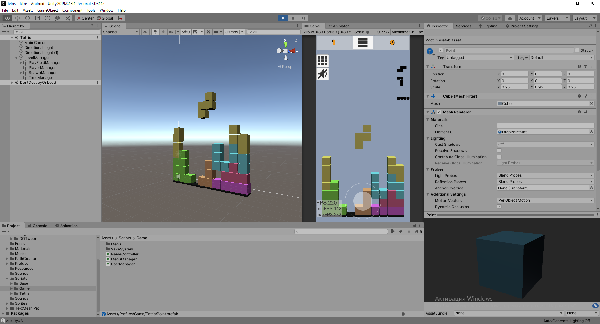

# Tetris
Tetris 3D

## Task:
Implement main game fitures of game Tetris:
1) Show 3 next Tetrominos (items in Tetris)
2) Random color for Tetrominos
3) Realize simple HUD-panel for main values (score, time game, ...)
4) Change speed of Tetrominos after some time of game
5) Realize main fitures of original game ... :-)

## Implemented:
All

+:
1) Develop system for easy create new Tetromino from simple cube
2) Control in game (auto switch):
    Mobile: visual controller
    PC: Left, Right, Up, Down buttons
3) Save system for settings in game
4) Settings system (Scriptable object) for easy changable settings for game
4) Sound, Music
5) Implement MVC principle
6) Use ObjectPool for reduce memory usage
7) ... and more ather

## Unity 2019.3.13

