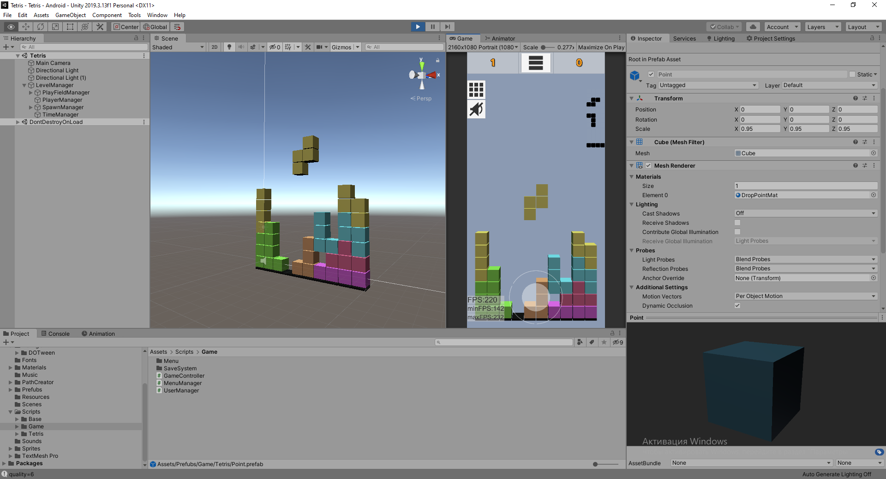

# Tetris
Tetris 3D, complex project

## Tasks:
1) Show the next 3 Tetrominoes (objects in Tetris).
2) Random color for Tetrominoes.
3) Implement a simple HUD panel for basic values (score, game time, etc.).
4) Change Tetromino speed after a certain game time.
5) Implement the basic functions of the original game ... :-).

## Additionally:
1) Extract the logic of the Tetris game in the files:
- PointField.cs - explanation of one part of the Tetromino;
- ObjectField.cs - explanation of one Tetromino (and rotation logic);
- PlayField.cs - explanation of the field for basic control rules in Tetris.
2) Develop a system for easy creation of a new Tetromino from a simple cube (ObjectField.cs).
3) Game control with automatic switching:
- Mobile: visual controller;
- PC: left, right, up, down buttons.
4) Save system for the game (save progress in the game).
5) Settings system (script object) for easy changing of game settings.
6) Sounds, music in the game.
7) Use of object pool to reduce memory usage.
8) ... and many more.

## Packages:
1) DoTween - for moving and fading panels in the user interface.
2) TextMeshPro - for example, using the package.

## Implemented:
All

## Unity 2022

